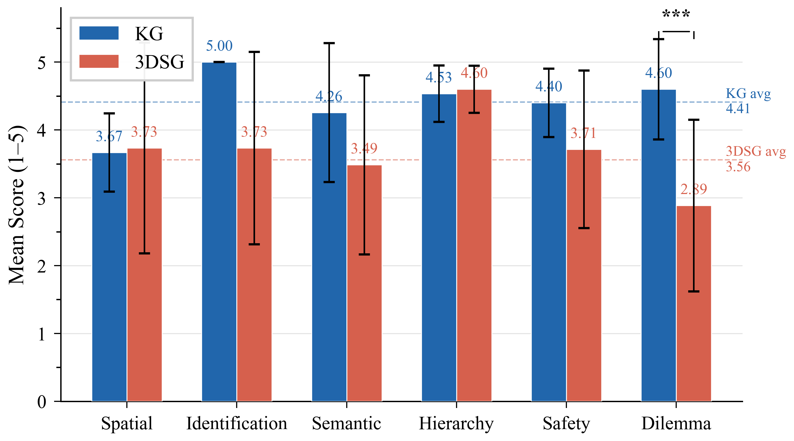
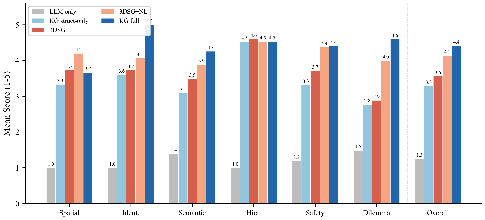
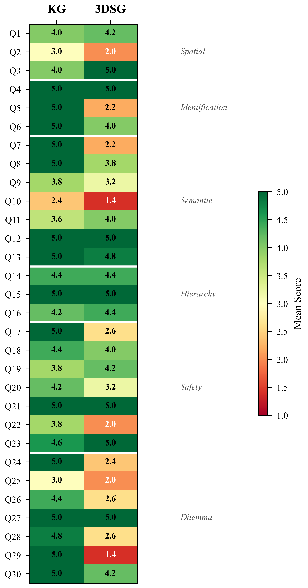
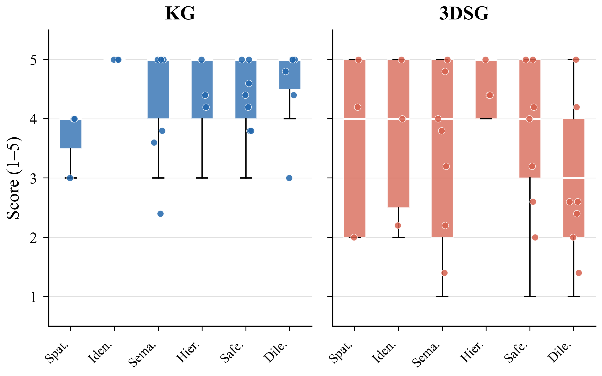

<div align="center">

# Knowledge Graph-Based Semantic Scene Understanding<br>for Autonomous Driving in Dilemma Situations

**[KSAE 2026 Spring Conference](https://www.ksae.org) · Accepted**

[Woongje Cho](https://woongje-cho.github.io)<sup>1</sup> · Hyeonseo Oh<sup>1</sup> · Junseok Lee<sup>2</sup> · Shiho Kim<sup>*3</sup>

<sup>1</sup>School of Mechanical Engineering, Yonsei University &nbsp;·&nbsp;
<sup>2</sup>School of Civil and Environmental Engineering, Yonsei University &nbsp;·&nbsp;
<sup>3</sup>School of Integrated Technology, Yonsei University

[](https://woongje-cho.github.io/paper/ksae2026/)
[](https://woongje-cho.github.io/paper/ksae2026/)
[](https://www.python.org)
[](LICENSE)

</div>

---

## Overview

For autonomous vehicles to operate safely in real-world environments, they must go beyond object detection and understand **semantic relations and situational context** within a scene.

Dilemma situations — conflicting constraints such as accident avoidance, pedestrian priority, and traffic rule compliance — are difficult to resolve using conventional **3D Scene Graphs (3DSGs)**, which mainly represent spatial structure.

We propose a **Knowledge Graph (KG)-enhanced semantic scene understanding framework** that represents traffic rules, class hierarchies, commonsense context, and scenario-specific semantic descriptions in a structured form.

<div align="center">

<br>
<em>Framework overview: KG-enhanced semantic scene understanding vs. 3DSG baseline</em>
</div>

---

## Key Results

<div align="center">

| Method | Mean Score (1–5) | Δ vs. Baseline |
|--------|:----------------:|:--------------:|
| LLM-only (no context) | 1.25 | — |
| KG structure-only | 3.29 | — |
| **3DSG baseline** | **3.56** | — |
| 3DSG + NL descriptions | 4.14 | +0.58 |
| **KG full (ours)** | **4.41** | **+0.85** |

**Wilcoxon p < 0.001 · Cohen's d = 0.84 (large effect) · N = 300 evaluations**

</div>

<div align="center">

<br>
<em>Category-wise comparison: KG achieves +1.71 gain in dilemma reasoning; spatial queries remain comparable (−0.07), confirming benchmark fairness</em>
</div>

<br>

<div align="center">

<br>
<em>5-condition ablation study: natural-language rdfs:comment descriptions are the dominant performance contributor</em>
</div>

---

## Method

We compare two retrieval strategies on identical perceptual input, isolating the contribution of **structured domain knowledge**:

```
Query (NL)
    │
    ├─ [KG Mode] ──► SPARQL (GraphDB DrivingKG) ──► Triples + rdfs:comment ──► GPT-4o-mini ──► Answer
    │                 1,498 triples · OWL ontology · traffic rules + commonsense
    │
    └─ [3DSG Mode] ─► Graph Traversal (scene_graph.json) ──► Spatial context ──► GPT-4o-mini ──► Answer
                      48 nodes · 23 edges · spatial + attributes
                                    │
                            GPT-4o Judge (1–5 rubric)
```

**6 cognitive query categories:** Object Recognition · Spatial Relations · Traffic Rule Compliance · Safety & Risk Assessment · **Dilemma Reasoning** · Commonsense Inference

<div align="center">

<br>
<em>Per-query performance heatmap: KG dominates semantic categories; spatial queries confirm design fairness</em>
</div>

---

## Repository Structure

```
kg-ad-scene-understanding/
├── assets/                            # Figures from the paper
│   ├── fig0_architecture.png          # Framework overview
│   ├── fig1_category_comparison.png   # Category-wise KG vs. 3DSG
│   ├── fig2_query_differences.png     # Query-level score differences
│   ├── fig3_score_distribution.png    # Score distribution (N=300)
│   ├── fig4_heatmap.png               # Per-query heatmap
│   └── fig5_ablation.png              # 5-condition ablation
├── experiment/
│   ├── experiment_v2.py               # Main experiment: KG vs. 3DSG (1,702 lines)
│   ├── experiment_ablation_v2.py      # 5-condition ablation study
│   ├── ground_truth.json              # 30 scene-understanding queries (6 categories)
│   └── scene_graph.json               # Enhanced 3DSG (48 nodes, 23 edges)
├── ontology/
│   ├── scene_tools_kg.py              # KG retrieval via SPARQL (GraphDB)
│   ├── scene_tools_dsg.py             # 3DSG graph traversal retrieval
│   └── scene_tools.py                 # Shared utilities
├── results/
│   ├── experiment_results_v2.json         # Full results (N=300)
│   ├── experiment_results_ablation_v2.json # 5-condition ablation results
│   └── experiment_results_ablation.json   # Original ablation results
├── requirements.txt
└── README.md
```

---

## Setup

### Prerequisites
- Python 3.9+
- **[GraphDB Free](https://www.ontotext.com/products/graphdb/graphdb-free/)** — must be running locally at `http://localhost:7200` with the `DrivingKG` repository loaded
- OpenAI API key

### Installation

```bash
git clone https://github.com/woongje-cho/kg-ad-scene-understanding.git
cd kg-ad-scene-understanding
pip install -r requirements.txt
```

```bash
export OPENAI_API_KEY="your-api-key"
```

### Loading the Ontology

Import `driving.owl` into GraphDB as the `DrivingKG` repository (rdfsplus-optimized) before running experiments. The ontology contains 1,498 triples covering AD objects, traffic rules, spatial relations, and dilemma scenarios.

---

## Running Experiments

### Main experiment (KG vs. 3DSG, N=300)
```bash
python experiment/experiment_v2.py
```
Outputs results to `results/experiment_results_v2.json`. Runtime ~30–60 min depending on OpenAI API rate limits.

### 5-condition ablation study
```bash
python experiment/experiment_ablation_v2.py
```

### Visualize results
Results JSON files can be directly used to reproduce all figures. See `experiment/experiment_v2.py` for the built-in plotting functions.

---

## Score Distribution

<div align="center">

<br>
<em>Score distribution (1–5): KG concentrates at 4–5; 3DSG shows broader spread with more 3-score responses</em>
</div>

---

## Citation

If you find this work useful, please cite:

```bibtex
@inproceedings{cho2026kg,
  title     = {Knowledge Graph-Based Semantic Scene Understanding
               for Autonomous Driving in Dilemma Situations},
  author    = {Cho, Woongje and Oh, Hyeonseo and Lee, Junseok and Kim, Shiho},
  booktitle = {Proceedings of the KSAE Spring Conference},
  year      = {2026},
  address   = {Seoul, Republic of Korea}
}
```

---

## License

MIT License · Copyright (c) 2026 Woongje Cho

---

<div align="center">
<a href="https://woongje-cho.github.io/paper/ksae2026/">Project Page</a> ·
<a href="https://woongje-cho.github.io">Author Portfolio</a> ·
<a href="mailto:woongje725@yonsei.ac.kr">Contact</a>
</div>
